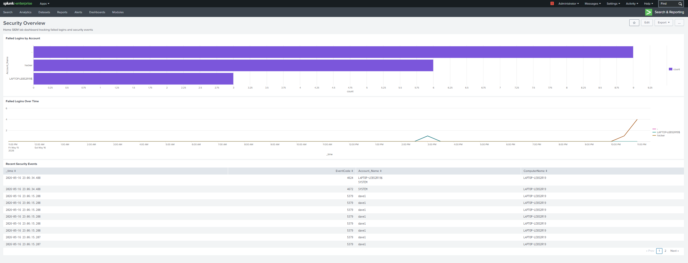

# Home SIEM Lab: Brute Force Detection with Splunk

## Overview

Built a home Security Information and Event Management (SIEM) lab using Splunk Enterprise on a Windows 11 machine to simulate a SOC analyst environment. Ingested live Windows Security event logs, developed detection rules for failed login activity and brute force patterns, simulated an attack, and built a real-time monitoring dashboard to visualize findings.

**Tools:** Splunk Enterprise 10.2.3, Windows Event Logs, PowerShell  
**Skills Demonstrated:** Log ingestion, SPL querying, alert creation, dashboard building, threat detection, attack simulation  
**MITRE ATT&CK Mapping:** [T1110 — Brute Force](https://attack.mitre.org/techniques/T1110/)

---

## Lab Environment

| Component | Details |
|---|---|
| Host OS | Windows 11 |
| SIEM Platform | Splunk Enterprise 10.2.3 (local, free trial) |
| Log Sources | Windows Security Events, Application Events, System Events |
| Endpoint | LAPTOP-LE8S2R19 |
| Total Events Ingested | 121,689+ |

---

## Lab Architecture

```
Windows 11 Endpoint (LAPTOP-LE8S2R19)
        │
        ├── Security Event Log  (failed logins, logon activity)
        ├── Application Event Log
        └── System Event Log
                │
                ▼
        Splunk Enterprise (localhost:8000)
                │
                ├── Detection Rules (SPL alerts)
                └── Security Overview Dashboard
```

---

## Windows Event Codes Reference

Understanding Windows Event IDs is core to SOC analyst work. The following codes were observed and used in this lab:

| Event Code | Meaning |
|---|---|
| 4624 | Successful logon |
| 4625 | Failed logon (primary detection target) |
| 4672 | Special privileges assigned to new logon |
| 4798 | User's local group membership enumerated (background activity) |
| 5379 | Credential Manager credentials read (background activity) |

---

## Detection 1: Brute Force Login Detection (EventCode 4625)

**Objective:** Detect accounts with 5 or more failed login attempts, indicating a potential brute force attack.

**SPL Query:**
```
index=main sourcetype=WinEventLog:Security EventCode=4625
| stats count by Account_Name, ComputerName
| where count > 0
| sort -count
```

**Proof of Concept: Attack Simulation:**

Simulated a brute force attack using PowerShell against the local machine across two sessions (2026-05-15 and 2026-05-16):
```powershell
net use \\localhost /user:hacker wrongpassword
```
The command was run a total of 6 times across both sessions, generating 6 EventCode 4625 entries for the account `hacker`. Each execution returned "System error 1326 — The user name or password is incorrect", confirming the failed login was logged by Windows.

**Result:** Splunk detection query identified the `hacker` account with a confirmed total count of 6 failed logins on `LAPTOP-LE8S2R19` across all time.


---

## Detection 2: Failed Logins Over Time (Timechart)

**Objective:** Visualize failed login activity over time to identify attack spikes and establish a baseline.

**SPL Query:**
```
index=main sourcetype=WinEventLog:Security EventCode=4625
| timechart count by Account_Name
```

**Result:** The line chart revealed distinct attack spikes across the monitoring period:

- **Spike 1:** Detected on 2026-05-15 at approximately 21:00 — corresponds to the first brute force simulation session against the `hacker` account
- **Spike 2:** Detected on 2026-05-16 at approximately 15:00 — corresponds to background machine account (`LAPTOP-LE8S2R19$`) authentication activity
- **Spike 3:** Detected on 2026-05-16 at approximately 23:00 — corresponds to the second brute force simulation session

No failed login activity was observed during the overnight baseline period (2026-05-15 22:00 through 2026-05-16 09:00), confirming normal system behavior during off-hours.

---

## Alert Configuration

Saved the brute force detection as a real-time Splunk alert:

| Setting | Value |
|---|---|
| Alert Name | Brute Force Login Detection |
| Alert Type | Real-time |
| Trigger Condition | Number of results > 5 within 1 minute |
| Severity | Medium |
| Action | Add to Triggered Alerts |
| Description | Detects potential brute force attacks by alerting when an account has more than 5 failed login attempts (EventCode 4625) within 1 minute |

---

## Security Overview Dashboard

Built a three-panel real-time monitoring dashboard in Splunk Classic Dashboards to visualize security events across all time.

**Panel 1: Failed Logins by Account (Bar Chart)**
```
index=main sourcetype=WinEventLog:Security EventCode=4625
| stats count by Account_Name
| sort -count
```

**Panel 2: Failed Logins Over Time (Line Chart)**
```
index=main sourcetype=WinEventLog:Security EventCode=4625
| timechart count by Account_Name
```

**Panel 3: Recent Security Events (Statistics Table)**
```
index=main sourcetype=WinEventLog:Security
| table _time, EventCode, Account_Name, ComputerName
| sort -_time
| head 20
```



---

## Key Findings

- **121,689+ events** ingested from Windows Security, Application, and System logs on initial setup
- **Pre-existing failed logins detected:** Prior to simulation, 4 failed login attempts were already present in the logs attributed to the machine account `LAPTOP-LE8S2R19$`, which is a real-world finding indicating normal background Windows authentication activity
- **Attack simulation successful:** Simulated brute force with 6 total failed attempts for account `hacker` across two sessions (2026-05-15 and 2026-05-16) was confirmed by the SPL detection query
- **Attack spikes clearly visible:** The timechart panel shows distinct spikes at approximately 21:00 on 2026-05-15 and 23:00 on 2026-05-16, which corresponds to each simulation session, demonstrating the value of time-based visualization for threat detection
- **Additional telemetry observed:** EventCode 5379 (Credential Manager read) activity was detected for user `dave1`, representing real background Windows credential activity captured passively by the SIEM with no additional configuration
- **Baseline established:** No failed login activity was observed during the overnight period, confirming normal off-hours system behavior and validating the detection rule threshold

---

## References

- [Splunk Documentation](https://docs.splunk.com)
- [Microsoft Windows Security Event Log Reference](https://docs.microsoft.com/en-us/windows/security/threat-protection/auditing/security-auditing-overview)
- [MITRE ATT&CK T1110 — Brute Force](https://attack.mitre.org/techniques/T1110/)
